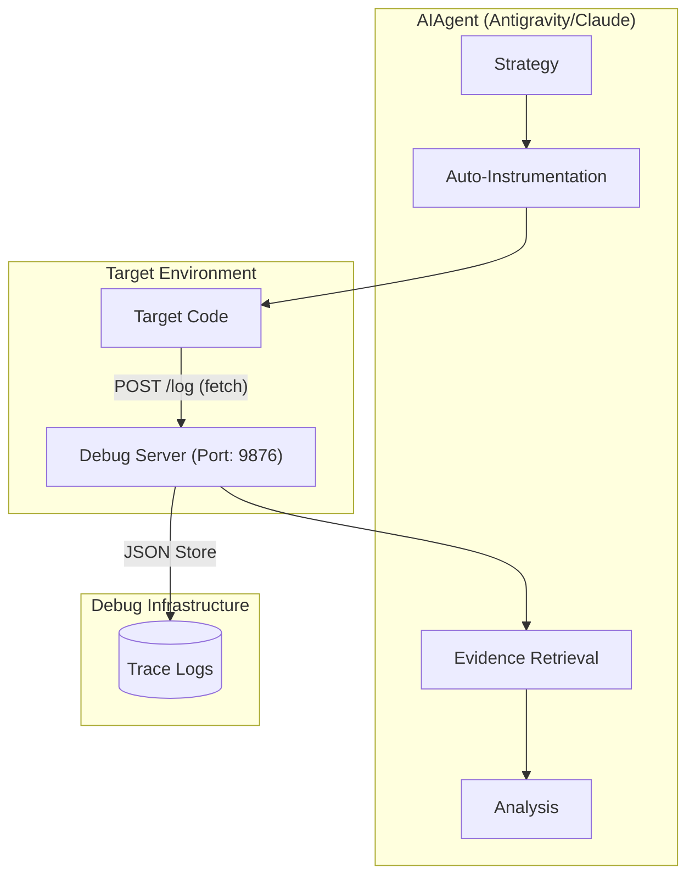
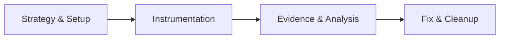

# Automated Instrumented Debugging

[](https://github.com/google-deepmind/antigravity)
[](https://claude.ai/)
[](https://opencode.com/)
[](https://nodejs.org/)

An **Automated Instrumented Debugging System** designed specifically for AI Agents (e.g., Antigravity, Claude Code, OpenCode). It transforms traditional "logging" into a **systematic evidence collection stream**.

[中文版](./README.md)

## 1. How It Works

Core Philosophy: **AI Instruments, System Aggregates, Developer Analyzes.**

### 1.1 System Architecture

Decouples and streams internal program states to a centralized debug server via lightweight HTTP.



### 1.2 Core Workflow

Employs a **4-Phase Systematic Debugging Methodology** to ensure a complete chain of evidence:



1.  **Strategy & Setup**: AI identifies potential fault points and starts the `debug-server`.
2.  **Instrumentation**: AI inserts `#region DEBUG` wrapped code blocks into critical paths.
3.  **Evidence & Analysis**: Run the program and retrieve execution traces/variable snapshots via API.
4.  **Fix & Cleanup**: Once fixed, run `cleanup.js` to automatically rollback all debug code.

---

## 2. Quick Start (AI Guide)

> [!TIP]
> These steps are primarily for AI Agent reference. Human developers only need to know the commands.

### Step 1: Start Server

```bash
node .agent/skills/automated-instrumented-debugging/debug-server.js
```

### Step 2: Instrumentation Template

AI will insert the following structure (with a unique `session` ID):

```javascript
// #region DEBUG - session_4b2a
fetch('http://localhost:9876/log', {
  method: 'POST',
  headers: { 'Content-Type': 'application/json' },
  body: JSON.stringify({ session: 'session_4b2a', type: 'trace', data: { varA } }),
}).catch(() => {});
// #endregion
```

### Step 3: Evidence Retrieval

```bash
curl http://localhost:9876/logs/session_4b2a
```

### Step 4: One-Click Cleanup

```bash
node .agent/skills/automated-instrumented-debugging/cleanup.js
```

---

## 3. Project Structure

Follows the **Standard Agentic Skill** specification:

```text
.agent/
└── skills/
    └── automated-instrumented-debugging/
        ├── SKILL.md         # AI Skill Instructions (Core)
        ├── debug-server.js  # Pure JS Log Server (Zero-dependency)
        └── cleanup.js       # Safe Instrumentation Cleanup Tool
workflows/
└── automated-debug.md       # Standardized Debug Workflow Definition
```

## 4. Resources

- [Detailed Installation Guide](./INSTALL.md)
- [Chinese Version](./README.md)

---

Powered by Antigravity.
