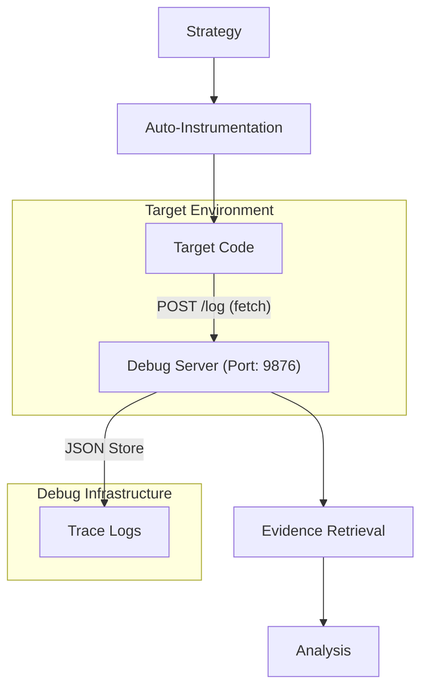
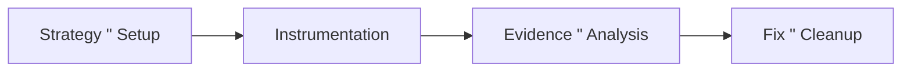

# Automated Instrumented Debugging

[](https://claude.ai/)
[](https://openai.com/codex/)
[](https://nodejs.org/)

An **Automated Instrumented Debugging** skill package tailored for **Claude Code** and **Codex**. It turns ad-hoc logging into a **systematic evidence collection loop**: the agent instruments, the local server aggregates, and the developer analyzes.

[中文版](./README.md) | [GitHub Repository](https://github.com/MinLeeV5/automated-instrumented-debugging-skill)

---

## 1. Installation

This repository now exposes a single Skill only. Workflows are intentionally removed for better cross-agent compatibility.

### 1.1 Automatic Installation (Recommended)

One-click installation via the `vercel-labs/skills` utility:

```bash
npx skills add MinLeeV5/automated-instrumented-debugging-skill
```

### 1.2 Manual Integration (Global)

Copy or clone the repository root into one of these destinations:

- **Claude Code**: `~/.claude/skills/automated-instrumented-debugging`
- **Codex**: `~/.codex/skills/automated-instrumented-debugging`

> [!NOTE]
> For more details, please refer to the [Detailed Installation Guide](./INSTALL.md).

---

## 2. How It Works

Core Philosophy: **AI Instruments, System Aggregates, Developer Analyzes.**

### 2.1 System Architecture

Decouples and streams internal program states to a centralized debug server via lightweight HTTP.


```mermaid
graph TD
    NodeA["Strategy"] --> NodeB["Auto-Instrumentation"]
    NodeC["Evidence Retrieval"] --> NodeD["Analysis"]

    subgraph "Target Environment"
        NodeE["Target Code"] -- "POST /log (fetch)" --> NodeF
    end

    subgraph "Debug Infrastructure"
        NodeF["Debug Server (Port: 9876)"] -- "JSON Store" --> NodeG["Trace Logs"]
    end

    NodeB --> NodeE
    NodeF --> NodeC
```

### 2.2 Core Workflow

Employs a **4-Phase Systematic Debugging Methodology** to ensure a complete chain of evidence:


```mermaid
graph LR
    P1["Strategy #quot; Setup"] --> P2["Instrumentation"]
    P2 --> P3["Evidence #quot; Analysis"]
    P3 --> P4["Fix #quot; Cleanup"]
```

1.  **Strategy & Setup**: AI identifies potential fault points and starts the `debug-server`.
2.  **Instrumentation**: AI inserts `#region DEBUG` wrapped code blocks into critical paths.
3.  **Evidence & Analysis**: Run the program and retrieve execution traces/variable snapshots via API.
4.  **Fix & Cleanup**: Once fixed, run `cleanup.js` to automatically rollback all debug code.

---

## 3. Quick Start (AI Guide)

> [!TIP]
> These steps are primarily for AI Agent reference. Human developers only need to know the commands.

### Step 1: Start Server

```bash
node scripts/bootstrap.js
```

### Step 2: Instrumentation Template

AI will insert the following structure (with a unique `session` ID):

```javascript
// #region DEBUG - session_4b2a
fetch('http://localhost:9876/log', {
  method: 'POST',
  headers: { 'Content-Type': 'application/json' },
  body: JSON.stringify({ session: 'session_4b2a', type: 'trace', data: { varA } }),
}).catch(() => {});
// #endregion
```

### Step 3: Evidence Retrieval

```bash
curl http://localhost:9876/logs/session_4b2a
```

### Step 4: One-Click Cleanup

```bash
node scripts/cleanup.js
```

---

## 4. Project Structure

The repository root itself is the skill:

```text
.
├── SKILL.md               # Skill instructions
├── agents/
│   └── openai.yaml        # Codex UI metadata
├── scripts/
│   ├── debug-server.js    # Zero-dependency log server
│   ├── bootstrap.js       # Server bootstrap
│   └── cleanup.js         # Probe cleanup tool
└── examples/
    └── typescript-demo/
```

---

Compatible with Claude Code and Codex.
