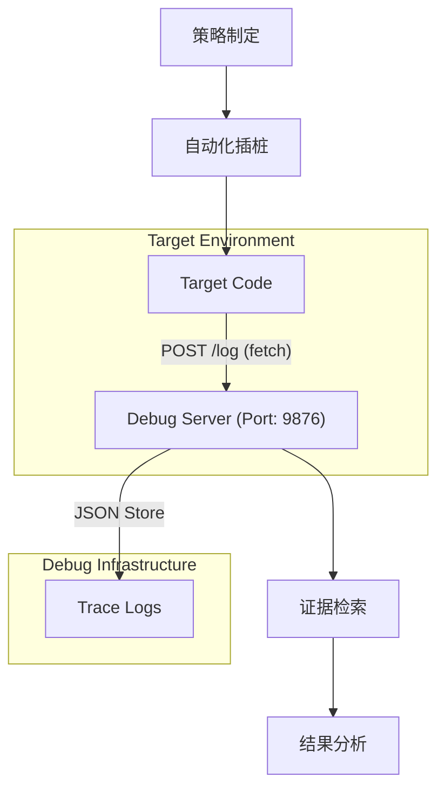
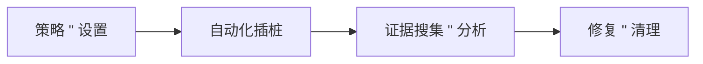

# 自动化插桩调试 (Automated Instrumented Debugging)

[](https://github.com/google-deepmind/antigravity)
[](https://claude.ai/)
[](https://opencode.com/)
[](https://nodejs.org/)

这是一个专为 AI Agent（如 Antigravity, Claude Code, OpenCode）设计的**自动化插桩调试系统**。它将传统的“打印日志”升级为一种**系统化的证据搜集流**。

[English Version](./README-EN.md) | [GitHub 仓库](https://github.com/MinLeeV5/automated-instrumented-debugging-skill)

---

## 1. 安装 (Installation)

你可以通过以下几种方式将此技能集成到你的开发流程中：

### 1.1 自动安装 (推荐)

通过 `vercel-labs/skills` 工具一键安装：

```bash
npx @vercel/skills add MinLeeV5/automated-instrumented-debugging-skill
```

### 1.2 手动集成 (全局)

将技能内容复制到 Agent 的专用技能目录：

- **Antigravity**: `~/.gemini/antigravity/skills/`
- **Claude Code**: `~/.claude/skills/`

### 1.3 项目级使用

如果当前项目已包含 `.agent/` 目录，Antigravity 等 Agent 会**自动识别**并加载：

- **技能路径**: `.agent/skills/automated-instrumented-debugging/`
- **工作流路径**: `.agent/workflows/automated-debug.md`

> [!NOTE]
> 更多细节请参考 [详细安装指南](./INSTALL.md)。

---

## 2. 技术原理

本工具的核心理念是：**AI 负责插桩，系统负责聚合，开发者负责分析。**

### 2.1 系统架构

通过轻量级的 HTTP 协议，将受测程序的内部状态解耦并传输至中心化调试服务器。



### 2.2 核心工作流

采用 **4 阶段系统化调试法**，确保证据链的完整性：



1.  **策略 & 设置**: AI 识别潜在故障点，启动 `debug-server`。
2.  **自动化插桩**: AI 在关键路径插入 `#region DEBUG` 包装的代码块。
3.  **证据搜集 & 分析**: 运行程序，通过 API 检索执行轨迹和变量快照。
4.  **修复 & 清理**: 确认修复后，运行 `cleanup.js` 自动回滚所有调试代码。

---

## 3. 快速开始 (AI Guide)

> [!TIP]
> 这里的步骤主要供 AI Agent 参考，人类开发者只需了解命令即可。

### 第一步：启动服务器

```bash
node .agent/skills/automated-instrumented-debugging/bootstrap.js
```

### 第二步：插桩模板

AI 会在代码中插入如下结构（带有唯一 `session` ID）：

```javascript
// #region DEBUG - session_4b2a
fetch('http://localhost:9876/log', {
  method: 'POST',
  headers: { 'Content-Type': 'application/json' },
  body: JSON.stringify({ session: 'session_4b2a', type: 'trace', data: { varA } }),
}).catch(() => {});
// #endregion
```

### 第三步：证据检索

```bash
curl http://localhost:9876/logs/session_4b2a
```

### 第四步：一键清理

```bash
node .agent/skills/automated-instrumented-debugging/cleanup.js
```

---

## 4. 项目结构

项目遵循 **Standard Agentic Skill** 规范：

```text
.agent/
├── skills/
│   └── automated-instrumented-debugging/
│       ├── SKILL.md         # AI 技能指令集 (核心)
│       ├── SKILL-CN.md      # 中文指令集
│       ├── debug-server.js  # 纯 JS 日志服务器 (零依赖)
│       ├── bootstrap.js     # 服务器启动引导
│       └── cleanup.js       # 安全插桩清理工具
└── workflows/
    └── automated-debug.md   # 标准化调试流程定义
```

---

由 Antigravity 强力驱动。
