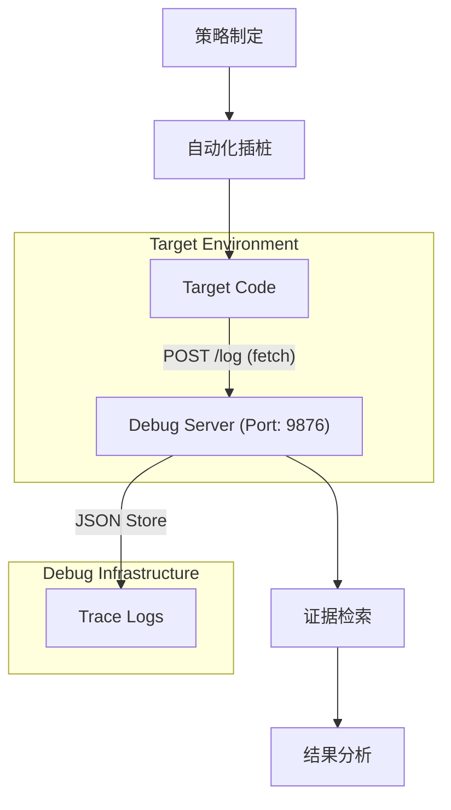
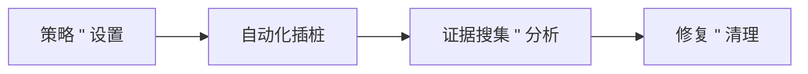

# 自动化插桩调试 (Automated Instrumented Debugging)

[](https://claude.ai/)
[](https://openai.com/codex/)
[](https://nodejs.org/)

这是一个面向 **Claude Code** 和 **Codex** 的单 Skill 版本自动化插桩调试系统。它将传统“打印日志”升级为一种**系统化的证据搜集流**：AI 负责临时插桩，调试服务器负责聚合证据，开发者负责分析与修复。

[English Version](./README-EN.md) | [GitHub 仓库](https://github.com/MinLeeV5/automated-instrumented-debugging-skill)

---

## 1. 安装 (Installation)

现在仓库只暴露一个 Skill，不再包含 workflows，便于在 Claude Code 与 Codex 之间复用。

### 1.1 自动安装 (推荐)

通过 `vercel-labs/skills` 工具一键安装：

```bash
npx skills add MinLeeV5/automated-instrumented-debugging-skill
```

### 1.2 手动集成 (全局)

将整个仓库根目录复制或克隆到以下目标之一：

- **Claude Code**: `~/.claude/skills/automated-instrumented-debugging`
- **Codex**: `~/.codex/skills/automated-instrumented-debugging`

> [!NOTE]
> 更多细节请参考 [详细安装指南](./INSTALL.md)。

---

## 2. 技术原理

本工具的核心理念是：**AI 负责插桩，系统负责聚合，开发者负责分析。**

### 2.1 系统架构

通过轻量级的 HTTP 协议，将受测程序的内部状态解耦并传输至中心化调试服务器。


```mermaid
graph TD
    NodeA["策略制定"] --> NodeB["自动化插桩"]
    NodeC["证据检索"] --> NodeD["结果分析"]

    subgraph "Target Environment"
        NodeE["Target Code"] -- "POST /log (fetch)" --> NodeF
    end

    subgraph "Debug Infrastructure"
        NodeF["Debug Server (Port: 9876)"] -- "JSON Store" --> NodeG["Trace Logs"]
    end

    NodeB --> NodeE
    NodeF --> NodeC
```

### 2.2 核心工作流

采用 **4 阶段系统化调试法**，确保证据链的完整性：


```mermaid
graph LR
    P1["策略 #quot; 设置"] --> P2["自动化插桩"]
    P2 --> P3["证据搜集 #quot; 分析"]
    P3 --> P4["修复 #quot; 清理"]
```

1.  **策略 & 设置**: AI 识别潜在故障点，启动 `debug-server`。
2.  **自动化插桩**: AI 在关键路径插入 `#region DEBUG` 包装的代码块。
3.  **证据搜集 & 分析**: 运行程序，通过 API 检索执行轨迹和变量快照。
4.  **修复 & 清理**: 确认修复后，运行 `cleanup.js` 自动回滚所有调试代码。

---

## 3. 快速开始 (AI Guide)

> [!TIP]
> 这里的步骤主要供 AI Agent 参考，人类开发者只需了解命令即可。

### 第一步：启动服务器

```bash
node scripts/bootstrap.js
```

### 第二步：插桩模板

AI 会在代码中插入如下结构（带有唯一 `session` ID）：

```javascript
// #region DEBUG - session_4b2a
fetch('http://localhost:9876/log', {
  method: 'POST',
  headers: { 'Content-Type': 'application/json' },
  body: JSON.stringify({ session: 'session_4b2a', type: 'trace', data: { varA } }),
}).catch(() => {});
// #endregion
```

### 第三步：证据检索

```bash
curl http://localhost:9876/logs/session_4b2a
```

### 第四步：一键清理

```bash
node scripts/cleanup.js
```

---

## 4. 项目结构

项目根目录本身就是 Skill：

```text
.
├── SKILL.md               # Skill 指令
├── agents/
│   └── openai.yaml        # Codex UI 元数据
├── scripts/
│   ├── debug-server.js    # 零依赖日志服务器
│   ├── bootstrap.js       # 服务启动引导
│   └── cleanup.js         # 插桩清理工具
└── examples/
    └── typescript-demo/
```

---

兼容 Claude Code 与 Codex。
